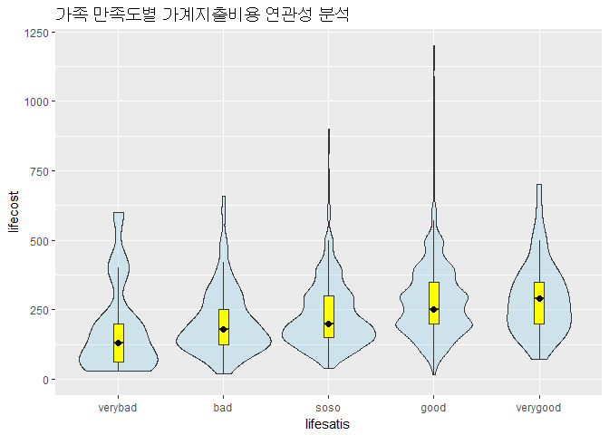
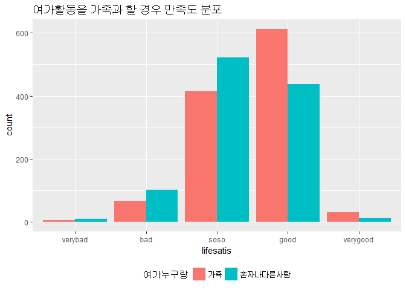
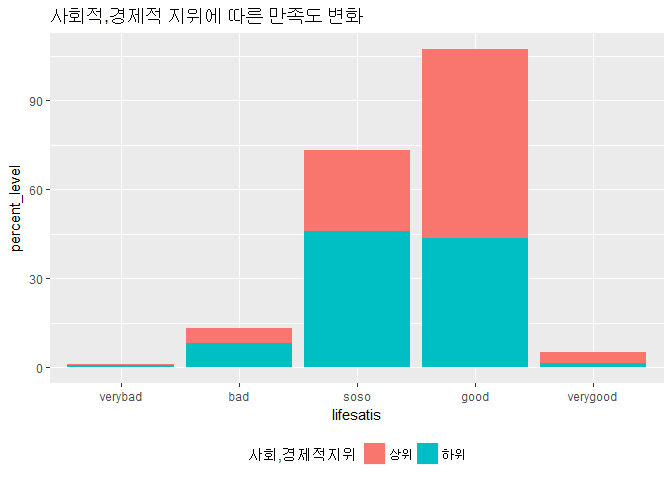

R progamming
================

가족생활 만족도와 여러 변수들의 연관성
======================================

1. 요약(초록)
-------------

워라벨, 소확행 등의 삶의 질에 관한 신조어가 생기는 등 삶의 질이 중요하게 생각되고 있는 요즘 통계청과 ‘한국 삶의 질 학회’가 발표한 ‘국민 삶의 질 종합지수’에 따르면, 2006 ~ 2015년 사이 국내 삶의 질 종합지수중 가족ㆍ공동체 지수는 10년 동안 오히려 1.4% 하락하며 유일하게 후퇴하는 모습을 보였다. 다른 지수는 다 상승하는 가운데 하락하는 이유를 분석해보고자 **본 연구**는 가족ㆍ공동체 지수에 영향을 주는 가족과의 유대 즉 가족생활 만족도와 연관성이 있는 요인에는 어떤것이 있는지 어떻게 영향을 주는지 분석한 것이다. **2015년 서울복지실태조사**에 따른 가족생활만족도와 연관성 있다고 생각되는 한달 평균생활비 지출액과 여가활동을 가족과 할때 그리고 주관적인 사회적, 경제적 위치를 통해 실증적인 분석자료를 제시하고자 한다. 연구의 대상은 서울에 거주하는 총 3019가구이며, 설문조사를 통한 통계치를 표본으로 한 데이터분석을 이용하였다.

분석한결과 **첫째**, 한달 평균생활비 지출액이 높다면 가족생활 만족도 또한 높은지 만족도에 따라 데이터 분석을 하였다. 이를 통해 만족도가 높은 경우 생활비지출액 평균이 높은 것으로 나타났다.

**둘째**, 여가활동을 가족과 즐기는 경우와 그렇지 않은 경우에 따라 만족도를 분석하였다. 이를 통해 다른 사람과 즐기는 것보다 가족과 함께 여가를 즐기는 경우가 가족생활 만족도가 상대적으로 더 높은 것으로 나타났다.

**셋째**, 주관적 사회적, 경제적 지위의 비율을 비교하여 가족생활 만족도가 어떻게 다른지 분석하였다. 이를 통해 사회적, 경제적 지위는 가족생활 만족도가 높은 경우 상위 비율이 하위비율보다 상대적으로 높게 나타나 사회적, 경제적 지위 또한 연관성이 있다고 보여진다.

**결론적으로** 가족생활 만족도는 생활비 지출액이 높을수록, 여가활동을 가족과 즐길때, 또 사회적, 경제적 지위가 높을루록 그렇지 않은 경우보다 상대적으로 높게 나타난다는 것을 알 수 있다. 이 요인들로 인하여 가족생활 만족도가 높은 것인지, 가족생활 만족도가 높아 이 요인들에 영향을 준 것인지 알 수 없다는 것과 가족생활 만족도에 영향을 주는 설문조사를 통해 드러나지 않은 요인이 있을 수 있다는 한계점이 존재하지만 가족생활 만족도와 분석한 세가지 요인들이 연관되어 있다는 것을 알 수 있었고, 가족만족도엥 각 변수들이 영향을 줄 수 있다는 것을 데이터 분석결과를 통해 알 수 있었다.

2. 분석주제
-----------

삶의 질에 관심이 높아지는 요즘 **워라벨**, **소확행** 등 많은 행복에 관한 신조어가 생기고 있고 국민 삶의 질 지수 통계 등 세계에서 통계를 내고 많은 연구와 논문이 쏟아지고 있는 요즘, 삶의 질에서 빠질 수 없는 부분인 가족 유대감과 가장 적합한 항목인 서울복지실태조사에서 알아본 가족 만족도와 여러 요인들이 연관성이 있는지 알아볼 것이다. 가족생활 만족도와 생활비지출액, 사회적, 경제적 지위, 여가활동을 누구와 즐기는지 가정에 연관되어 있다고 생각하는 여러 변수들을 설정하여 연관성을 알아볼 것이다.

3. 데이터 선정
--------------

가족생활만족도를 수치로 표현하고 통계낸다는 것은 어려운 현실이다. **2015 서울복지실태조사**를 통해 3000여가구의 가족생활만족도를 조사한 원자료를 이용하여 조사한다면 한 데이터로 가족생활만족도와 함께 영향을 주는 여러 요인들을 설정하기 좋은 데이터로 생각하여 선정하였다. 서울, 즉 한정된 지역으로 설정되었다는 한계점이 있지만 현실적으로 전국적인 조사를 실시하기 어렵고, 서울이 인구밀집지역으로서 조사하기 용이하다는 장점이 있다.

이 데이터의 출처는 **서울연구데이터서비스**에서 자료에 대한 설명과 함께 설문조사 목적과 내용에 대하여 알아볼 수 있다. 다운로드 URL은 [여기](http://data.si.re.kr/sisurvey2015er17)이다. 코드북, 기초분석 보고서, 설문조사용지, 원 데이터 등 관련 자료를 모두 받을 수 있다. 총 3019가구, 활용된 지역은 총 303구이며, 전체 응답자의 52.1%가 가구주이고 배우자가 44.8%로 구성되어 있으며, 대부분 낮에 조사가 이루어져 여성 응답자가 72.9%로 편증된 측면이 있다.

4. 분석
-------

### 4-1 가계 생활비 지출에 따른 가족 만족도 분석

#### 분석 목적 및 방법

각 가구마다 한달평균 가계 생활비 지출액(월평균/만원)이 가족 만족도에 따라 어떻게 달라지는지 분석한 것이다. 가계 생활비 지출액이 많을수록 가족 만족도가 높게 분석된다면 가구가 가정에 돈을 얼마나 쓰는지가 가족 만족도와 연관성이 있다는 것을 알 수 있다. 따라서 가구의 삶의 질인 가족 만족도에 영향을 주는 요인으로 해석할 수 있을 것이다. 분석은 상, 중상, 중, 중하, 하로 평가되는 가족만족도에 각각의 변수를 부여한뒤 만족도에 따른 가계 생활비 지출액을 'geom\_boxplot()' + 'geom\_violinplot()'으로 나타내어 생활비 지출액이 높을수록 가족만족도가 높은지 상관관계를 분석할 것이다.

#### 변수 검토 및 전처리

먼저 필요한 패키지를 로드한 다음, 데이터를 불러온뒤 어떻게 구성되어 있는지 확인하는 작업을 한다. 그 데이터자료에서 필요한 데이터들만 골라 다시 데이터를 가공한 다음 이상치나 결측치가 있을 경우 전처리 과정을 행할 것이다.

**변수 이름**은 다음과 같다.

ID = HOUSE - 응답가구 ID B2 = LIFECOST - 2014년 한달 평균 생활비 지출액(월평균/만원) B3\_1 = costnum1 - 한달생활비 지출비중\_1순위 B3\_2 = costnum2 - 한달생활비 지출비중\_2순위 B14 = socialrank - 본인가구의 주관적 사회경제적 위치 D1 = lifesatis - 가족생활 만족도 D13 = hobbywith - 여가활동 함께하는 사람

``` r
#####패키지로드

library(readxl)
library(ggplot2) 
library(dplyr)
 

####데이터 불러오기 및 이름 변경

seoul <- read_excel("seoul.xlsx")
seoull <- seoul                       

#####데이터 파악

head(seoull)
```

    ## # A tibble: 6 x 828
    ##      ID fff_wgt s_wgt  area respondent A1_2_1 A1_2_2 A1_2_3 A1_2_4 A1_2_5
    ##   <dbl>   <dbl> <dbl> <dbl>      <dbl>  <dbl>  <dbl>  <dbl>  <dbl>  <dbl>
    ## 1    2.   1473. 1.27     3.         1.     1.     2.     3.     3.     NA
    ## 2    3.   1460. 1.26     5.         2.     1.     2.     3.    NA      NA
    ## 3    4.    322. 0.277    3.         2.     1.     2.     3.    NA      NA
    ## 4    5.    655. 0.564    3.         1.     1.     2.     3.     3.     NA
    ## 5    6.    588. 0.506    3.         1.     1.     3.    NA     NA      NA
    ## 6    7.    538. 0.464    3.         2.     1.     2.    NA     NA      NA
    ## # ... with 818 more variables: A1_2_6 <dbl>, A1_2_7 <dbl>, A1_2_8 <lgl>,
    ## #   A1_2_9 <lgl>, A1_2_10 <lgl>, A1_3_1 <dbl>, A1_3_2 <dbl>, A1_3_3 <dbl>,
    ## #   A1_3_4 <dbl>, A1_3_5 <dbl>, A1_3_6 <dbl>, A1_3_7 <dbl>, A1_3_8 <lgl>,
    ## #   A1_3_9 <lgl>, A1_3_10 <lgl>, A1_4_1_1 <dbl>, A1_4_1_2 <dbl>,
    ## #   A1_4_1_3 <dbl>, A1_4_1_4 <dbl>, A1_4_1_5 <dbl>, A1_4_1_6 <dbl>,
    ## #   A1_4_1_7 <dbl>, A1_4_1_8 <lgl>, A1_4_1_9 <lgl>, A1_4_1_10 <lgl>,
    ## #   A1_4_2_1 <dbl>, A1_4_2_2 <dbl>, A1_4_2_3 <dbl>, A1_4_2_4 <dbl>,
    ## #   A1_4_2_5 <dbl>, A1_4_2_6 <dbl>, A1_4_2_7 <dbl>, A1_4_2_8 <lgl>,
    ## #   A1_4_2_9 <lgl>, A1_4_2_10 <lgl>, age_1 <dbl>, age_2 <dbl>,
    ## #   age_3 <dbl>, age_4 <dbl>, age_5 <dbl>, age_6 <dbl>, age_7 <dbl>,
    ## #   age_8 <lgl>, age_9 <lgl>, age_10 <lgl>, A1_5_1 <dbl>, A1_5_2 <dbl>,
    ## #   A1_5_3 <dbl>, A1_5_4 <dbl>, A1_5_5 <dbl>, A1_5_6 <dbl>, A1_5_7 <dbl>,
    ## #   A1_5_8 <lgl>, A1_5_9 <lgl>, A1_5_10 <lgl>, A1_6_1 <dbl>, A1_7_1 <dbl>,
    ## #   A1_8_1 <dbl>, A1_9_1 <dbl>, A1_6_2 <dbl>, A1_7_2 <dbl>, A1_8_2 <dbl>,
    ## #   A1_9_2 <dbl>, A1_6_3 <dbl>, A1_7_3 <dbl>, A1_8_3 <dbl>, A1_9_3 <dbl>,
    ## #   A1_6_4 <dbl>, A1_7_4 <dbl>, A1_8_4 <dbl>, A1_9_4 <dbl>, A1_6_5 <dbl>,
    ## #   A1_7_5 <dbl>, A1_8_5 <dbl>, A1_9_5 <dbl>, A1_6_6 <dbl>, A1_7_6 <dbl>,
    ## #   A1_8_6 <dbl>, A1_9_6 <dbl>, A1_6_7 <dbl>, A1_7_7 <dbl>, A1_8_7 <dbl>,
    ## #   A1_9_7 <dbl>, A1_6_8 <lgl>, A1_7_8 <lgl>, A1_8_8 <lgl>, A1_9_8 <lgl>,
    ## #   A1_6_9 <lgl>, A1_7_9 <lgl>, A1_8_9 <lgl>, A1_9_9 <lgl>, A1_6_10 <lgl>,
    ## #   A1_7_10 <lgl>, A1_8_10 <lgl>, A1_9_10 <lgl>, A1_10 <dbl>, fam_n <dbl>,
    ## #   fam_t <dbl>, fam_t_t <dbl>, child_n <dbl>, ...

``` r
str(seoull)
```

    ## Classes 'tbl_df', 'tbl' and 'data.frame':    3019 obs. of  828 variables:
    ##  $ ID          : num  2 3 4 5 6 7 8 9 10 11 ...
    ##  $ fff_wgt     : num  1473 1460 322 655 588 ...
    ##  $ s_wgt       : num  1.269 1.258 0.277 0.564 0.506 ...
    ##  $ area        : num  3 5 3 3 3 3 3 3 3 3 ...
    ##  $ respondent  : num  1 2 2 1 1 2 1 1 1 1 ...
    ##  $ A1_2_1      : num  1 1 1 1 1 1 1 1 1 1 ...
    ##  $ A1_2_2      : num  2 2 2 2 3 2 3 3 2 2 ...
    ##  $ A1_2_3      : num  3 3 3 3 NA NA 3 NA 3 3 ...
    ##  $ A1_2_4      : num  3 NA NA 3 NA NA NA NA 3 3 ...
    ##  $ A1_2_5      : num  NA NA NA NA NA NA NA NA NA NA ...
    ##  $ A1_2_6      : num  NA NA NA NA NA NA NA NA NA NA ...
    ##  $ A1_2_7      : num  NA NA NA NA NA NA NA NA NA NA ...
    ##  $ A1_2_8      : logi  NA NA NA NA NA NA ...
    ##  $ A1_2_9      : logi  NA NA NA NA NA NA ...
    ##  $ A1_2_10     : logi  NA NA NA NA NA NA ...
    ##  $ A1_3_1      : num  1 1 1 1 2 1 2 2 1 1 ...
    ##  $ A1_3_2      : num  2 2 2 2 2 2 1 1 2 2 ...
    ##  $ A1_3_3      : num  1 1 1 2 NA NA 2 NA 1 1 ...
    ##  $ A1_3_4      : num  2 NA NA 2 NA NA NA NA 2 2 ...
    ##  $ A1_3_5      : num  NA NA NA NA NA NA NA NA NA NA ...
    ##  $ A1_3_6      : num  NA NA NA NA NA NA NA NA NA NA ...
    ##  $ A1_3_7      : num  NA NA NA NA NA NA NA NA NA NA ...
    ##  $ A1_3_8      : logi  NA NA NA NA NA NA ...
    ##  $ A1_3_9      : logi  NA NA NA NA NA NA ...
    ##  $ A1_3_10     : logi  NA NA NA NA NA NA ...
    ##  $ A1_4_1_1    : num  1954 1950 1964 1962 1966 ...
    ##  $ A1_4_1_2    : num  1958 1955 1996 1962 1995 ...
    ##  $ A1_4_1_3    : num  1984 1989 1992 1985 NA ...
    ##  $ A1_4_1_4    : num  1986 NA NA 1988 NA ...
    ##  $ A1_4_1_5    : num  NA NA NA NA NA NA NA NA NA NA ...
    ##  $ A1_4_1_6    : num  NA NA NA NA NA NA NA NA NA NA ...
    ##  $ A1_4_1_7    : num  NA NA NA NA NA NA NA NA NA NA ...
    ##  $ A1_4_1_8    : logi  NA NA NA NA NA NA ...
    ##  $ A1_4_1_9    : logi  NA NA NA NA NA NA ...
    ##  $ A1_4_1_10   : logi  NA NA NA NA NA NA ...
    ##  $ A1_4_2_1    : num  7 1 7 2 4 8 8 6 12 11 ...
    ##  $ A1_4_2_2    : num  6 9 5 3 8 11 9 3 1 3 ...
    ##  $ A1_4_2_3    : num  9 2 10 7 NA NA 2 NA 5 5 ...
    ##  $ A1_4_2_4    : num  8 NA NA 5 NA NA NA NA 8 2 ...
    ##  $ A1_4_2_5    : num  NA NA NA NA NA NA NA NA NA NA ...
    ##  $ A1_4_2_6    : num  NA NA NA NA NA NA NA NA NA NA ...
    ##  $ A1_4_2_7    : num  NA NA NA NA NA NA NA NA NA NA ...
    ##  $ A1_4_2_8    : logi  NA NA NA NA NA NA ...
    ##  $ A1_4_2_9    : logi  NA NA NA NA NA NA ...
    ##  $ A1_4_2_10   : logi  NA NA NA NA NA NA ...
    ##  $ age_1       : num  61 65 51 53 49 77 58 49 50 50 ...
    ##  $ age_2       : num  57 60 19 53 20 71 28 19 49 48 ...
    ##  $ age_3       : num  31 26 23 30 NA NA 25 NA 22 21 ...
    ##  $ age_4       : num  29 NA NA 27 NA NA NA NA 20 22 ...
    ##  $ age_5       : num  NA NA NA NA NA NA NA NA NA NA ...
    ##  $ age_6       : num  NA NA NA NA NA NA NA NA NA NA ...
    ##  $ age_7       : num  NA NA NA NA NA NA NA NA NA NA ...
    ##  $ age_8       : logi  NA NA NA NA NA NA ...
    ##  $ age_9       : logi  NA NA NA NA NA NA ...
    ##  $ age_10      : logi  NA NA NA NA NA NA ...
    ##  $ A1_5_1      : num  1 1 1 1 1 1 1 1 1 1 ...
    ##  $ A1_5_2      : num  1 1 1 1 1 1 1 1 1 1 ...
    ##  $ A1_5_3      : num  1 1 1 1 NA NA 1 NA 1 1 ...
    ##  $ A1_5_4      : num  1 NA NA 1 NA NA NA NA 1 1 ...
    ##  $ A1_5_5      : num  NA NA NA NA NA NA NA NA NA NA ...
    ##  $ A1_5_6      : num  NA NA NA NA NA NA NA NA NA NA ...
    ##  $ A1_5_7      : num  NA NA NA NA NA NA NA NA NA NA ...
    ##  $ A1_5_8      : logi  NA NA NA NA NA NA ...
    ##  $ A1_5_9      : logi  NA NA NA NA NA NA ...
    ##  $ A1_5_10     : logi  NA NA NA NA NA NA ...
    ##  $ A1_6_1      : num  5 5 6 5 5 3 5 5 5 5 ...
    ##  $ A1_7_1      : num  5 5 5 5 5 5 5 5 5 5 ...
    ##  $ A1_8_1      : num  1 1 1 1 3 1 2 3 1 1 ...
    ##  $ A1_9_1      : num  1 1 1 1 1 1 1 1 1 1 ...
    ##  $ A1_6_2      : num  5 5 7 5 5 3 7 5 5 5 ...
    ##  $ A1_7_2      : num  5 5 5 5 5 5 5 5 5 5 ...
    ##  $ A1_8_2      : num  1 1 1 1 5 1 5 5 1 1 ...
    ##  $ A1_9_2      : num  1 1 1 1 1 1 1 1 1 1 ...
    ##  $ A1_6_3      : num  5 5 7 6 NA NA 7 NA 7 5 ...
    ##  $ A1_7_3      : num  5 5 1 5 NA NA 5 NA 1 5 ...
    ##  $ A1_8_3      : num  5 5 5 5 NA NA 5 NA 5 5 ...
    ##  $ A1_9_3      : num  1 1 1 1 NA NA 1 NA 1 1 ...
    ##  $ A1_6_4      : num  6 NA NA 6 NA NA NA NA 7 7 ...
    ##  $ A1_7_4      : num  5 NA NA 5 NA NA NA NA 1 1 ...
    ##  $ A1_8_4      : num  5 NA NA 5 NA NA NA NA 5 5 ...
    ##  $ A1_9_4      : num  1 NA NA 1 NA NA NA NA 1 1 ...
    ##  $ A1_6_5      : num  NA NA NA NA NA NA NA NA NA NA ...
    ##  $ A1_7_5      : num  NA NA NA NA NA NA NA NA NA NA ...
    ##  $ A1_8_5      : num  NA NA NA NA NA NA NA NA NA NA ...
    ##  $ A1_9_5      : num  NA NA NA NA NA NA NA NA NA NA ...
    ##  $ A1_6_6      : num  NA NA NA NA NA NA NA NA NA NA ...
    ##  $ A1_7_6      : num  NA NA NA NA NA NA NA NA NA NA ...
    ##  $ A1_8_6      : num  NA NA NA NA NA NA NA NA NA NA ...
    ##  $ A1_9_6      : num  NA NA NA NA NA NA NA NA NA NA ...
    ##  $ A1_6_7      : num  NA NA NA NA NA NA NA NA NA NA ...
    ##  $ A1_7_7      : num  NA NA NA NA NA NA NA NA NA NA ...
    ##  $ A1_8_7      : num  NA NA NA NA NA NA NA NA NA NA ...
    ##  $ A1_9_7      : num  NA NA NA NA NA NA NA NA NA NA ...
    ##  $ A1_6_8      : logi  NA NA NA NA NA NA ...
    ##  $ A1_7_8      : logi  NA NA NA NA NA NA ...
    ##  $ A1_8_8      : logi  NA NA NA NA NA NA ...
    ##  $ A1_9_8      : logi  NA NA NA NA NA NA ...
    ##  $ A1_6_9      : logi  NA NA NA NA NA NA ...
    ##  $ A1_7_9      : logi  NA NA NA NA NA NA ...
    ##   [list output truncated]

``` r
dim(seoull)
```

    ## [1] 3019  828

``` r
####필요한 데이터 추출, 변수명 수정

seoull <- seoull%>%
  select(ID,B2,B14,D1,D13) 

seoull <- rename(seoull,house=ID, lifecost=B2, 
                 socialrank=B14, lifesatis=D1, hobbywith=D13)

####결측치 확인 및 이상치를 결측치로 수정

table(is.na(seoull))
```

    ## 
    ## FALSE 
    ## 15095

``` r
seoull$lifecost <- ifelse(seoull$lifecost == 9999,NA,seoull$lifecost)  ##모름, 무응답한 경우 -> 결측치로 처리
seoull$lifesatis <- ifelse(seoull$lifesatis == 0,NA,seoull$lifesatis)  ##1인가구의 경우 비해당 -> 결측치로 처리


table(is.na(seoull$lifecost))
```

    ## 
    ## FALSE  TRUE 
    ##  3006    13

``` r
table(is.na(seoull$lifesatis))
```

    ## 
    ## FALSE  TRUE 
    ##  2222   797

#### 분석 및 해석

가족 만족도별 생활비지출액의 violinplot + boxplot을 나타내어 분석해봤더니, 만족도가 낮은 very bad, bad 부분에서는 good, very good보다 상대적으로 생활비 지출액이 낮게 나타났다. 검은 점의 중간값을 비교해본 결과 만족도가 올라갈수록 각각의 생활비 지출액 중간값이 올라간다는 것을 알 수 있다. 이 데이터 분석을 통해서 생활비지출액과 가족 만족도는 서로 연관성이 있다는 것을 알 수 있다.

``` r
####결측치 제거 후 만족도별로 변수 부여

seoul_satis <- seoull%>%
  filter(!is.na(lifesatis),!is.na(lifecost))  ##결측치 제거

seoul_satis$lifesatis <-  ifelse(seoul_satis$lifesatis == 1,"verybad",   ##매우 안좋음
                                 ifelse(seoul_satis$lifesatis == 2,"bad",   ##안좋음
                                        ifelse(seoul_satis$lifesatis == 3, "soso", ##보통,다음은 좋음과 매우좋음
                                               ifelse(seoul_satis$lifesatis == 4, "good","verygood"))))


####분석하기 전 극단치 확인


library(Hmisc)                  ##기술통계 패키지
describe(seoul_satis$lifecost)  ##차이가 많이나는 극단값 확인 highest에서극단치 4000, 4450 제거 요망
```

    ## seoul_satis$lifecost 
    ##        n  missing distinct     Info     Mean      Gmd      .05      .10 
    ##     2210        0       73    0.993    255.7    144.3    100.0    100.0 
    ##      .25      .50      .75      .90      .95 
    ##    150.0    230.0    307.5    400.0    500.0 
    ## 
    ## lowest :   15   20   30   36   40, highest:  900 1000 1200 4000 4450

``` r
####violin plot + box plot으로 데이터 분석

ggplot(seoul_satis, aes(x = lifesatis, y = lifecost))+
  geom_violin(alpha=0.3,fill="sky blue")+         ##색깔, 투명도 지정
  geom_boxplot(width=0.1, fill="yellow", outlier.colour=NA)+
  stat_summary(fun.y="median", geom="point", shape=21, size=2, fill="black")+ ##색깔  및 중간값 까만 점으로 표시
  ggtitle("가족 만족도별 가계지출비용 연관성 분석")+    ##제목
  scale_x_discrete(limits=c("verybad","bad","soso","good","verygood"))+ ##만족도 순서 정렬
  ylim(0,1200)  ##차이가 많이나는 극단치 2개 제거한 범위 지정
```



### 4-2 여가활동을 가족과 함께 즐길 경우 가족 만족도 분석

#### 분석 목적 및 방법

각 가구원마다 여가활동을 같이하는 사람이 가족인 경우와 아닌경우에 따라 가족만족도가 어떻게 달라지는지 분석을 하였다. 가족만족도는 앞에서와 마찬가지로 상, 중상, 중, 중하, 하로 평가되는 가족 만족도에 각각의 변수를 부여한뒤 만족도에 따른 가계 생활비 지출액을 'geom\_barplot()'으로 나타내 보았다. 여가활동을 같이 하는 사람이 가족일때는 family, 가족이 아닌경우에는 other로 나타내어 각 경우에 따라 가족만족도와 연관성이 있는지 알아보기 위해 bar 그래프를 사용했다. 가족과 함께 여가를 보내는 경우 넓게 해석한다면 그만큼 가족과 보내는 시간이 많을수록 가족 만족도가 높게 나타나는지 알아보기 위해 이 분석을 하였다.

#### 변수 검토 및 전처리

여가활동을 같이 하는 사람 중 기타로 분류된 경우는 결측치로 바꾸어 제거하도록 한다. 확인해본 결과 이상치가 없어 결측치가 없기때문에 넘어가기로 한다.

``` r
####이상치 제거 및 결측치 확인

seoull$hobbywith <- ifelse(seoull$hobbywith == 6,NA,seoull$hobbywith)
table(is.na(seoull$hobbywith))
```

    ## 
    ## FALSE 
    ##  3019

#### 분석 및 해석

여가활동을 가족과 함께 즐길때의 만족도 가구수와 여가활동을 다른 사람들과 즐길때의 만족도 가구수를 비교하는 분석을 하였다. 가족과의 여가시간을 즐기는 것은 시간을 조금 더 보내는 것으로 해석되는 바이다. 그러므로 여가활동을 가족과 즐길때 높은 만족도 수가 더 많이 나타난다는 것을 bar 그래프를 통해 알 수 있었다. 빨간색의 막대그래프가 가족과 보내는 경우 파란색의 막대그래프가 가족이 아닌 다른 사람들과 보내는 경우이다. 만족도는 앞의 분석과 같다. 이 데이터 분석을 통해서 여가활동을 가족과 보내는 경우 높은 가족만족도 수가 상대적으로 여가활동을 다른 사람들과 혹은 혼자 보내는 경우보다 많이 나타난다는 것을 알 수 있다.

``` r
####앞의 가족 만족도 결측치 제거한 데이터를 사용, 가족과 즐기는 경우와 아닌 경우를 변수로 설정

seoul_hobby <- seoul_satis%>%
  filter(!is.na(hobbywith))%>%
  mutate(withfam=ifelse(hobbywith==2,"family","other"))

table(seoul_hobby$withfam)  ## 데이터 수 차이가 크지 않음
```

    ## 
    ## family  other 
    ##   1129   1081

``` r
####bar그래프로 데이터 분석

ggplot(data=seoul_hobby) +
  geom_bar(mapping = aes(x=lifesatis, fill=as.factor(withfam)), position = "dodge") + 
  theme(legend.position = "bottom")+ ##x축은 가족만족도, y축은 여가누구랑 즐기는지에 따른 수, 범례위치
  scale_x_discrete(limits=c("verybad","bad","soso","good","verygood"))+
  scale_fill_discrete(name="여가누구랑",
                      labels=c("가족","혼자나다른사람"))+ ##범례 이름 설정
  ggtitle("여가활동을 가족과 할 경우 만족도 분포") ##분석 이름 설정
```



### 4-3 주관적 사회적, 경제적 위치에 따른 가족 만족도 분석

#### 분석 목적 및 방법

사회적, 경제적 위치가 높고 낮음에 따라 가족 만족도의 높고 낮음이 연관되어 있는지 알아보기 위한 분석이다. 먼저 사회적, 경제적 위치가 상상, 상하, 중상, 중하, 하상, 하하로 나뉘어져 있는데 이를 상상, 상하, 중상을 **상위**로 보고 나머지를 **하위**로 설정하여 경제적 위치가 높고 낮음에 따라 가족 만족도가 변화하는지 bar 누적비율 그래프를 통해 알아봤다.

#### 변수 검토 및 전처리

``` r
####앞에서 전처리한 변수 seoul_satis를 이용, 사회적, 경제적 지위를 high, low 두 분류로 다시 설정하는 변수를 설정

seoul_level <- seoul_satis%>%
  mutate(level=ifelse(socialrank<=3,"high","low"))

####지위별, 만족도별 데이터로 묶은 뒤 지위별 만족도 비율 변수를 생성

table(seoul_level$level)   ##둘의 수를 비교
```

    ## 
    ## high  low 
    ##  421 1789

``` r
seoul_ll <- seoul_level%>%    ##차이가 많이 나는 측정치이므로 그룹별 데이터로 묶고 빈도 변수 생성
  group_by(level,lifesatis)%>%
  summarise(count=n())
seoul_ll3 <- seoul_ll%>%mutate(percent_level=count/sum(count)*100) ##빈도 변수를 활용해 비율 변수 생성
```

#### 분석 및 해석

가족만족도와 사회적, 경제적 지위가 과연 연관성이 있는지 bar비율 누적그래프를 통해 알아보았다. 사회적, 경제적 지위가 높은 상위의 경우 good, very good 의 높은 만족도 부분에서 지위가 낮은 하위의 경우보다 더 높은 비율을 차지한다는 것으로 해석할 수 있다. 또한 만족도가 very bad, bad 의 낮은 부분에서는 지위가 낮은 하위의 경우가 높은 상위의 경우보다 상대적으로 높은 비율을 보이고 있다는 것을 알 수 있다. 이 분석을 통해 사회적, 경제적 지위가 가족만족도와 연관성이 있다는 것으로 해석할 수 있고, 가족만족도에 영향을 주는 요인으로 여겨지는 바이다.

``` r
####가족만족도와 사회적, 경제적 지위의 연관성을 나타내는 bar비율 누적그래프 생성

ggplot(seoul_ll3, aes(x=lifesatis,y=percent_level, fill=as.factor(level))) +  
  geom_bar(stat = "identity")+  ##비율누적막대그래프
  theme(legend.position = "bottom")+  ##범례위치
  scale_x_discrete(limits=c("verybad","bad","soso","good","verygood"))+ 
  scale_fill_discrete(name="사회,경제적지위", labels=c("상위","하위"))+  ##범례 이름
  ggtitle("사회적,경제적 지위에 따른 만족도 변화") ##제목
```



5. 논의
-------

이 데이터 분석을 통해 가족생활 만족도와 여러 변수들이 연관성이 있는지 그래프를 통해 알아볼 수 있었다. 하지만 가족생활 만족도라는 개념이 지극히 주관적이며, 설문조사를 통해 이루어졌기 때문에 다른 사람을 의식하여 일부러 좋게 혹은 불성실하게 응답할 수 있다는 한계점이 있으며, 여러 변수들이 가족생활 만족도에 영향을 주는 것인지 아니면, 가족생활 만족도가 이 여러변수들에 영향을 주는지는 데이터분석을 통해 알 수 없었다. 또한 세번째 분석에서의 주관적 사회적, 경제적 지위라는 것은 정확하게 소득분위나 사회적 위치 등으로 나눈 것이 아닌 주관적인 가구의 의견이라 실질적인 지위랑 연결된다고 보기는 어렵다. 이러한 한계점들을 보완하기 위해서는 전국적인 설문조사를 통하여 가족생활 만족도 원자료를 토대로 하여 분석하고, 가족생활만족도에 영향을 줄 수 있는 다른 요인들이 또 있는지 조사한다면 가족생활만족도에 대한 연구를 더 깊이있고, 정확하게 할 수 있을 것이다. 또한 정확한 소득분위에 따른 계층별 가족생활 만족도를 분석한다면 위 분석을 보완할 수 있을 것이다. 추후에는 가족생활 만족도에 영향을 주는 요인들을 한번에 모아서 가족생활 만족도를 주 데이터로 설정하고, 여러 요인을 주는 변수들끼리 상관관계를 파악하고, 그 변수들을 한번에 모아 가족생활 만족도가 높은지 분석한다면 가족생활 만족도에 영향을 주는 많은 변수들을 파악할 수 있을 것이며, 가족생활 만족도에 각 변수마다 영향을 주는 정도 또한 분석할 수 있다.
